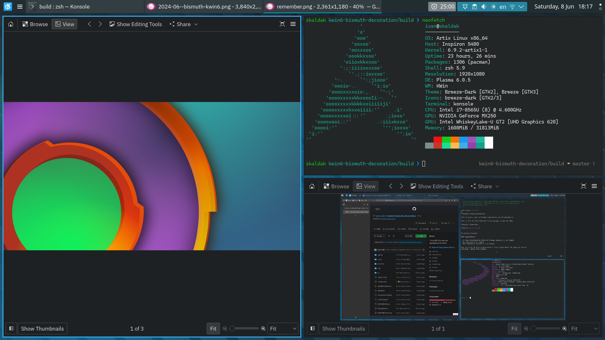

<!--
  SPDX-FileCopyrightText: 2021-2022 Mikhail Zolotukhin <mail@gikari.com>
  SPDX-FileCopyrightText: 2018-2019 Eon S. Jeon <esjeon@hyunmu.am>
  SPDX-License-Identifier: MIT
-->

# Bismuth window decoration

This is just a port of Bismuth decoration for Plasma/KWin 6.

This is not the full Bismuth tiling manager script for KWin.

Original screenshot:

## 🏁 Getting Started

### Requirements

- A Linux distribution with KDE Plasma version 6.1 or higher
- Qt version 6.5 or higher
- KDE Frameworks version 6.3 or higher

You can check if your system matches these requirements by going to System
Settings > About this System.

